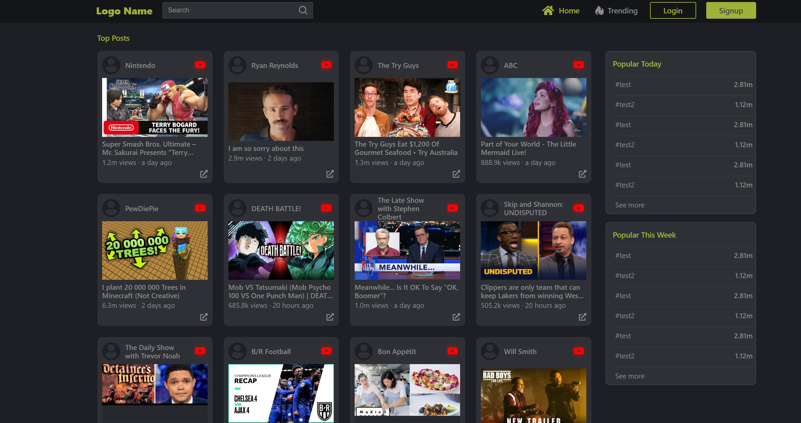

# A small project created to get to know the YouTube API.

## To Get Started

Download Project Files and Install Dependencies

- **Fork** and **Clone** this repository.
- **CD into the folder** where you cloned the repository.
- Use your **Google developer account** to create a project and a **YouTube Data API v3 API key**.
- Create `.env` file and save the API key. You may need to restart the environment to make it visible.
- Type `yarn` or `npm install` to download all dependencies listed inside `package.json` in both the client and server directory.
- To start the development server type `yarn server` or `npm run server` in the server.
- To start the development client server type `yarn start` or `npm run start` in the client.

### Test the main feature

- If all is successful, one should see a feed of popular Youtube videos by visiting the "/" route.

